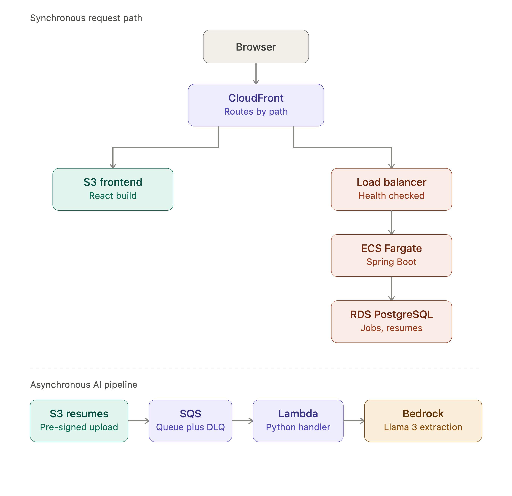

# SkillMap

An AI-powered resume and job matching platform built on AWS. Recruiters paste a
job description and an LLM extracts the required skills. Candidates upload a
resume and the same model extracts theirs. The system scores the match and emails
the result.

Built end to end: Spring Boot backend, React frontend, event-driven AI pipeline,
all infrastructure provisioned with Terraform, deployed via GitHub Actions.

---

## Architecture



```
Browser (HTTPS)
    │
    ▼
CloudFront ─────────────────────────────────┐
    │                                       │
    │ /jobs /resumes /match                 │ /api/*
    ▼                                       ▼
S3 (React static build)          Application Load Balancer
                                            │
                                            ▼
                                      ECS Fargate
                                      (Spring Boot)
                                            │
                                            ▼
                                    RDS PostgreSQL
                                            ▲
────────────────────────────────────────────┼──────────────
Asynchronous AI pipeline                    │
                                            │
S3 (resume upload) → SQS → Lambda ──────────┤
                             │              │
                             ├──→ Bedrock (Llama 3)
                             │
                             └──→ SNS → email notification
```

The system has two distinct interaction models. The synchronous path is standard
request/response — a user clicks something and waits for an answer. The
asynchronous path is event-driven — a resume lands in S3 and a chain of
processing fires without anyone waiting on it. The two halves meet at RDS, where
Lambda writes the extracted skills that the Spring Boot API later reads.

Routing all traffic through a single CloudFront distribution (static assets to
S3, `/api/*` to the ALB) means the whole application is same-origin over HTTPS —
which sidesteps both CORS and mixed-content problems entirely.

---

## AWS services

| Service | Purpose |
|---|---|
| CloudFront | CDN, HTTPS termination, path-based routing |
| S3 | React static hosting + private resume storage |
| ALB | Load balancing and health checks for ECS |
| ECS Fargate | Serverless Spring Boot containers |
| RDS PostgreSQL | Jobs, resumes, extracted skills, match scores |
| SQS | Decouples S3 events from Lambda; DLQ for failed messages |
| Lambda | Asynchronous resume processing (Python) |
| Bedrock | Llama 3 skill extraction from resumes and job descriptions |
| SNS | Email notifications for processing and match results |
| Secrets Manager | Database credentials, injected into containers at runtime |
| CloudWatch | Structured JSON logs, metric alarms, dashboard |
| ECR | Private Docker image registry |
| VPC endpoints | Private connectivity for Lambda and ECS to AWS services |
| IAM | Task roles, execution roles, least-privilege policies |

---

## Tech stack

**Backend** — Spring Boot 3.5, Java 21, JPA/Hibernate, Lombok
**Frontend** — React 18, Vite, React Router
**Database** — PostgreSQL (RDS in AWS, Docker Compose locally)
**Infrastructure** — Terraform (every AWS resource, no console clicking)
**CI/CD** — GitHub Actions (test on every push, deploy on merge to main)
**Containers** — Docker multi-stage builds, ECR, ECS Fargate
**AI** — AWS Bedrock with Meta Llama 3 8B Instruct

---

## How it works

### Posting a job

A recruiter submits a job title, company, and the raw job description text. If no
skills are provided explicitly, Spring Boot sends the description to Bedrock and
Llama 3 returns a comma-separated skill list.

```
Input:  "We are hiring a Platform Engineer with strong AWS, Kubernetes,
         and Terraform experience. Must know CI/CD pipelines and have
         hands-on Docker skills. PostgreSQL knowledge is a plus."

Output: AWS, Kubernetes, Terraform, CI/CD, Docker, PostgreSQL
```

### Uploading a resume

The browser requests a pre-signed S3 URL from the backend, then uploads the PDF
directly to S3 — the file never passes through the application server. The
correlation ID for that request is attached to the S3 object as custom metadata.

The upload triggers an S3 event notification to SQS. Lambda picks up the message,
reads the correlation ID back from the object metadata (so the trace continues
across services), extracts the resume text, sends it to Bedrock, writes the
extracted skills to RDS, and publishes to SNS.

### Matching

Skills from the resume are compared against the job's required skills.
Case-insensitive keyword overlap produces a percentage score, along with lists of
matched and missing skills. The result is saved to RDS and emailed via SNS.

---

## Observability

**Structured logging** — All logs are JSON, in both Spring Boot (Logback with the
Logstash encoder) and Lambda (a custom JSON logger). This makes CloudWatch
Insights queries like `filter matchScore < 50` possible, which plain text logs
can't support.

**Correlation IDs** — A servlet filter generates a unique ID per HTTP request and
puts it in the SLF4J MDC, so every log line for that request carries it
automatically. The ID is passed to Lambda via S3 object metadata, meaning a
single CloudWatch search reconstructs a resume's entire journey across Spring
Boot, S3, Lambda, RDS, and SNS.

**Alarms and dashboard** — Six CloudWatch alarms cover Lambda errors and
duration, DLQ depth, RDS CPU and connection count, and ECS CPU and memory. All
route to the same SNS topic. A single dashboard shows Lambda invocations, RDS
load, ECS utilisation, queue depth, and a live table of recent errors.

---

## Local development

```bash
# Start PostgreSQL
docker-compose up -d

# Run the backend
./mvnw spring-boot:run

# Run the frontend (separate terminal)
cd frontend
npm install
npm run dev
```

The frontend runs on `localhost:5173` and proxies `/api` to `localhost:8080`.

Local config lives in `application-local.properties` (gitignored). AWS features
degrade gracefully when not configured — for example, SNS notifications log the
result instead of failing when no topic ARN is set.

---

## Deploying to AWS

```bash
# Provision all infrastructure
cd terraform
terraform apply

# Build and push the backend image
aws ecr get-login-password --region ap-south-1 | \
  docker login --username AWS --password-stdin 369602466018.dkr.ecr.ap-south-1.amazonaws.com

docker build --platform linux/amd64 -t skillmap:latest .
docker tag skillmap:latest 369602466018.dkr.ecr.ap-south-1.amazonaws.com/skillmap:latest
docker push 369602466018.dkr.ecr.ap-south-1.amazonaws.com/skillmap:latest

# Build and deploy the frontend
cd frontend && npm run build && cd ..
aws s3 sync frontend/dist/ s3://skillmap-frontend-dev/ --delete

cd terraform
aws cloudfront create-invalidation \
  --distribution-id $(terraform output -raw cloudfront_distribution_id) \
  --paths "/*"
```

After the first `terraform apply`, refresh the GitHub Actions credentials in
repository secrets and confirm the SNS email subscription — both are regenerated
on every apply.

From then on, pushing to `main` triggers the full pipeline automatically: tests
run, the image builds, it pushes to ECR, ECS redeploys, and the workflow waits
for the service to stabilise before reporting success.

### Tearing down

```bash
aws s3 rm s3://skillmap-resumes-dev --recursive
aws s3 rm s3://skillmap-frontend-dev --recursive
cd terraform && terraform destroy
```

Infrastructure is treated as disposable — everything is destroyed after each
working session and recreated on demand. CloudFront takes 15–25 minutes to
delete.

---

## Testing

CI runs the test suite on every push and every pull request. The `deploy` job
only runs on merges to `main`.

A full end-to-end test — recruiter posts a job, candidate uploads a resume, AI
extracts skills from both, match score calculated, email delivered, correlation
ID traced across all services — is documented in
[`docs/e2e-test-results.md`](docs/e2e-test-results.md), including the six
production bugs that test surfaced and how each was fixed.

---

## Project structure

```
skillmap/
├── src/main/java/com/skillmap/
│   ├── config/          # AWS clients, CORS, correlation ID filter
│   ├── controller/      # REST endpoints
│   ├── dto/             # Request/response objects
│   ├── model/           # JPA entities
│   ├── repository/      # Spring Data repositories
│   └── service/         # Business logic, Bedrock, SNS, matching
├── frontend/            # React + Vite
├── lambda/
│   └── resume_processor/  # Python handler + psycopg2 layer
├── terraform/           # All AWS infrastructure
├── docs/                # Architecture diagram, test results
├── .github/workflows/   # CI/CD pipeline
└── Dockerfile           # Multi-stage build
```

---

## Notes and limitations

- Match scoring uses keyword overlap rather than semantic similarity, so
  "Node.js" and "JavaScript" are treated as unrelated. Vector embeddings with
  pgvector would be the natural next step.
- Llama 3 8B requires a strict prompt template and post-processing to return
  clean structured output — the model happily rambles or echoes its own control
  tokens without it.
- Anything running in a private subnet (Lambda, ECS) needs a VPC endpoint for
  every AWS service it calls. Missing endpoints for S3, Bedrock, Secrets Manager,
  ECR, CloudWatch Logs, and SNS each produced their own silent timeout during
  development.
